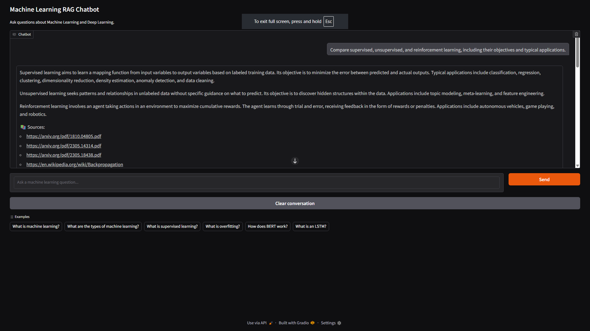
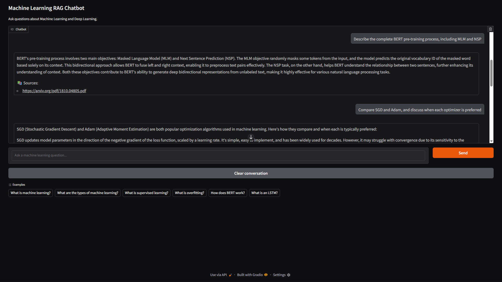
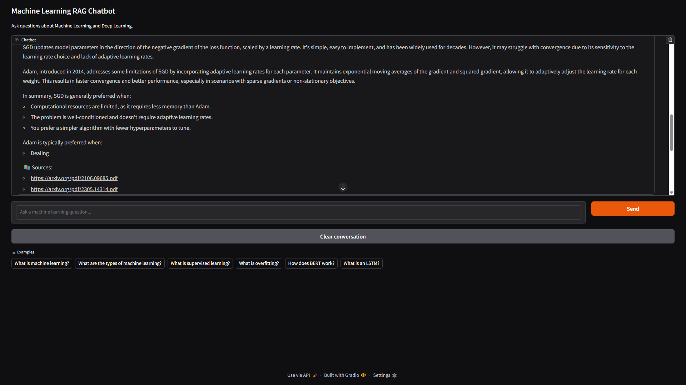
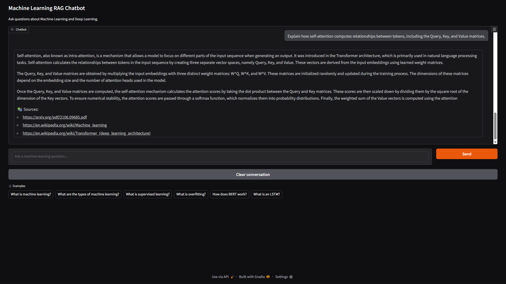

# 🤖 Machine Learning RAG Chatbot

An end-to-end **Retrieval-Augmented Generation (RAG)** chatbot for answering **Machine Learning and Deep Learning** questions using research papers and trusted educational resources.

The chatbot combines **hybrid retrieval (BM25 + FAISS + CrossEncoder re-ranking)** with the **IBM Granite 3.0 8B Instruct** large language model to generate accurate, context-aware responses. It also includes **RAGAS evaluation** to measure response quality and faithfulness.

> **Note:** This project was developed and tested on **Kaggle Notebooks** using GPU acceleration due to local hardware limitations.

---

## 🚀 Features

- 📄 Loads Machine Learning research papers using **Docling**
- 🌐 Retrieves information from trusted web sources (Wikipedia)
- ✂️ Intelligent document chunking using LangChain text splitters
- 🔍 Hybrid Retrieval:
  - BM25 (Keyword Search)
  - FAISS (Dense Vector Search)
  - CrossEncoder Re-ranking
- 🧠 IBM Granite 3.0 8B Instruct (4-bit Quantized)
- 💬 Interactive chatbot built with Gradio
- 📝 Conversation memory using LangChain
- 📚 Displays retrieved document sources
- 📊 RAGAS evaluation using Faithfulness and Answer Relevancy metrics

---

## 🏗️ Architecture

```
Research Papers + Web Sources
            │
            ▼
     Document Loading
     (Docling + WebLoader)
            │
            ▼
      Text Preprocessing
            │
            ▼
      Document Chunking
            │
            ▼
 BGE-Small Embeddings + FAISS
            │
            ▼
      BM25 Retrieval
            │
            ▼
   Ensemble Hybrid Retrieval
            │
            ▼
 CrossEncoder Re-ranking
            │
            ▼
 IBM Granite 3.0 8B Instruct
            │
            ▼
      Response Generation
            │
            ▼
         Gradio UI
```

---

## 🛠️ Tech Stack

### Programming Language

- Python

### Frameworks & Libraries

- LangChain
- LangChain Community
- LangChain Classic
- LangChain HuggingFace
- LangChain Docling
- Docling
- Hugging Face Transformers
- Sentence Transformers
- FAISS
- BM25
- Gradio
- RAGAS
- PyTorch
- Accelerate
- BitsAndBytes

### Models

- IBM Granite 3.0 8B Instruct
- BAAI/bge-small-en-v1.5
- CrossEncoder (MS MARCO MiniLM)
- Qwen2.5-1.5B-Instruct (RAGAS Judge)

---

## 📚 Knowledge Sources

### Research Papers

- BERT
- LSTM
- LoRA
- QLoRA
- RLHF

### Web Resources

- Machine Learning
- Transformer Architecture
- Gradient Descent
- Backpropagation
- Supervised Learning
- Overfitting
- Dropout
- Long Short-Term Memory

---

## 📸 Application Screenshots

### Home Interface



### Machine Learning Question Answering



### Retrieved Sources



### Additional Conversation Example



---

## 📊 RAGAS Evaluation

The chatbot was evaluated using the official **RAGAS** framework.

### Metrics

- Faithfulness
- Answer Relevancy

### Average Scores

| Metric | Score |
|---------|------:|
| Faithfulness | **1.0000** |
| Answer Relevancy | **0.9944** |

---

## 📦 Project Structure

```
ml-rag-chatbot/
│
├── ML_RAG_Chatbot.ipynb
├── README.md
├── requirements.txt
├── LICENSE
├── .gitignore
└── screenshots/
    ├── ml_rag_1.png
    ├── ml_rag_2.png
    ├── ml_rag_3.png
    └── ml_rag_4.png
```

---

## ⚙️ Installation

Clone the repository:

```bash
git clone https://github.com/SAHIL254/ml-rag-chatbot.git
cd ml-rag-chatbot
```

Install the required dependencies:

```bash
pip install -r requirements.txt
```

Launch the notebook:

```bash
jupyter notebook ML_RAG_Chatbot.ipynb
```

> **Note:** The project was originally developed on **Kaggle** using GPU acceleration. Running locally may require installing the appropriate CUDA-enabled version of PyTorch.

---

## 📋 Requirements

Major dependencies include:

- Python 3.x
- PyTorch
- LangChain
- Hugging Face Transformers
- FAISS
- Sentence Transformers
- Gradio
- RAGAS
- BitsAndBytes

See **requirements.txt** for the complete list.

---

## 🎯 Future Improvements

- Multi-document upload support
- Streaming responses
- Conversation summarization
- PDF upload through the UI
- Multiple embedding model options
- Support for additional LLMs
- Docker deployment
- Hugging Face Spaces deployment

---

## 👨‍💻 Author

**Sahil Dervankar**

B.Tech Computer Science & Engineering (AI/ML)


---

## 📄 License

This project is licensed under the **Apache License 2.0**.
